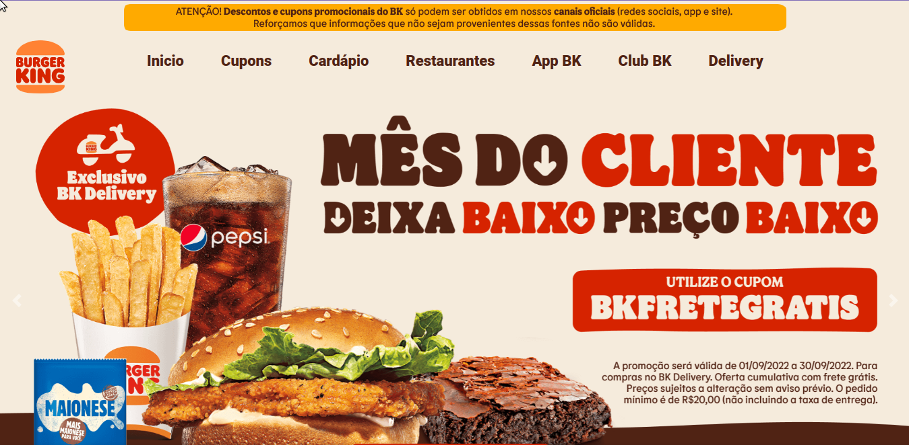

# Burger King clone 

## 
 Clone da página oficial da Burguer King com alterações na fonte, utilizando a mais similar que encontrei. 
 
 #

## 🚀 Acesse o projeto:
[Clique aqui para acessar](https://anafts.github.io/Burger-King-clone)

#

## 🛠️ Technologies: 

# 

## 📚 Learning
 - Navbar visível quando usar o scroll up
 - Carousel duplo

#

## 💌 Contact-me
Se você gostou do meu projeto, então me segue nas minhas redes sociais. 

  
   

